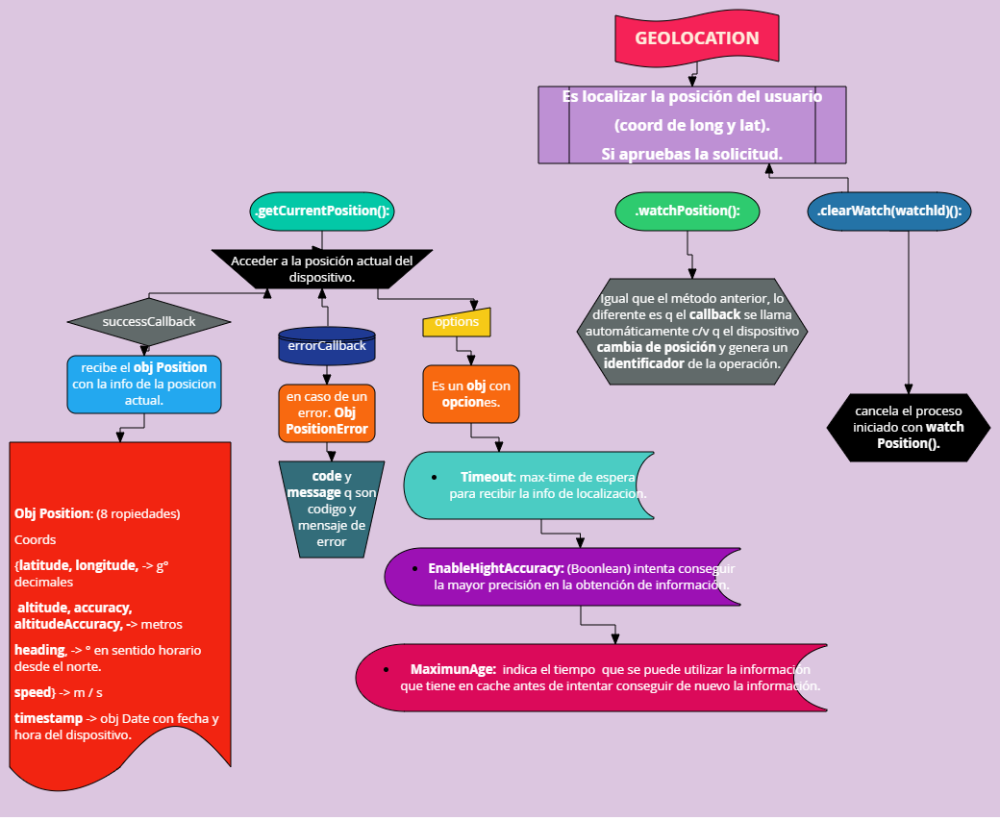

# Geolocation

***
# APIS Y Más
### Canvas (animation)
Puede usarse para dibujar gráficos a través de scripting
<https://developer.mozilla.org/en-US/docs/Web/API/Canvas_API/Tutorial/Basic_animations>

### WEBSOCKETS
API que establece conexiones "socket" entre un navegador web y un servidor,  ambas partes pueden empezar a enviar datos en cualquier momento.

### VIBRATION
Permite que a través del código de software se pueda emitir estas vibraciones.
